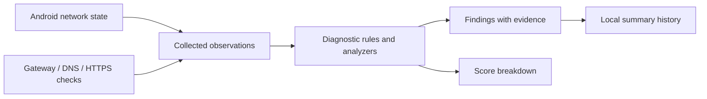

# NetPulse

**Connected to Wi-Fi. Still not working. Where do you look next?**

A connection icon and a speed number leave out much of the path between a phone and a working request. DNS can fail while the link is up; a gateway may reject probes while external HTTPS works; one endpoint may be unreachable while others respond.

NetPulse is an Android network diagnostic that separates these observations. It checks the local link, gateway, resolvers and HTTPS endpoints, then turns the results into findings with supporting measurements and possible causes.

## Read the failure by layer

| Layer | What NetPulse observes |
|---|---|
| Connection | Transport, platform validation and link information |
| Gateway | Reachability and timing, with the actual ICMP/TCP method shown |
| DNS | System resolution alongside direct queries to advertised resolvers |
| HTTPS | Results from three public endpoints, including DNS, timeout, connection, TLS and status failures |
| Reliability | Ten sequential HTTPS requests: success rate, timeouts, median and jitter |

The side-by-side DNS paths are especially useful: they let you investigate a discrepancy between system resolution and individual resolvers. Each result retains its measurement method so a failure can be interpreted in context.

The health score summarizes connectivity, gateway, DNS, latency and HTTPS reliability with separate contributions. Open the details to inspect the evidence, then revisit local summary history when comparing networks. [Measurement methods](docs/network-diagnostics.md)

## How findings are produced



Platform checkers run off the main thread. The [diagnostic engine](app/src/main/java/com/noise/netpulse/domain/engine/DiagnosticEngine.kt) evaluates combinations of results; pure analyzers classify latency and request reliability. This separates the act of measuring from the interpretation, with JVM tests covering findings, scoring and DNS packet parsing.

A run tracks network identity. If a change is detected mid-run, it cancels so measurements from different connections are not presented as one completed diagnosis. Progress shows the active stage. [Architecture](docs/architecture.md) · [Score calculation](app/src/main/java/com/noise/netpulse/domain/scoring/HealthScoreCalculator.kt)

## Try two connections

```bash
./gradlew assembleDebug
adb install app/build/outputs/apk/debug/app-debug.apk
```

Run on Wi-Fi, expand DNS/HTTPS details, then repeat on mobile data. Compare the findings and score components rather than just the total. In a separate run, switch networks to exercise interruption. History supports deleting individual summaries or clearing them all.

Run the domain checks with `./gradlew testDebugUnitTest`.

## Interpret the measurements within their reach

Gateway probes are not definitive router-health tests: ICMP or the fallback ports may be blocked. Mobile gateways may be unavailable, and some gateway addresses are derived heuristically. Direct UDP DNS does not reproduce every Private DNS/cache behavior. Public endpoints can be filtered independently of wider internet access.

Reliability means application-request success, not packet loss or bandwidth. Grades and partial credit for missing score components are project heuristics. Per-attempt socket timeouts limit much of the probe work, but system DNS is blocking without an app-specified deadline; total run/cancellation time has no hard bound. [Timing details](docs/performance.md)

Reports stay local, while DNS/HTTPS probes necessarily contact external services that observe the requests and source IP. Platform TLS validation remains enabled. There is no NetPulse backend, analytics or inspection of other apps' traffic. [Privacy](docs/privacy.md)

Real-network accuracy and device timing need further validation. Continuous monitoring, full-report export and broader IPv6 diagnostics remain future work.
